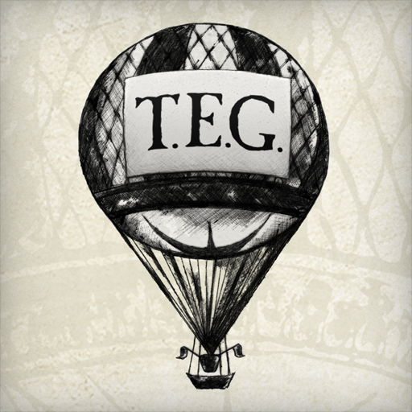
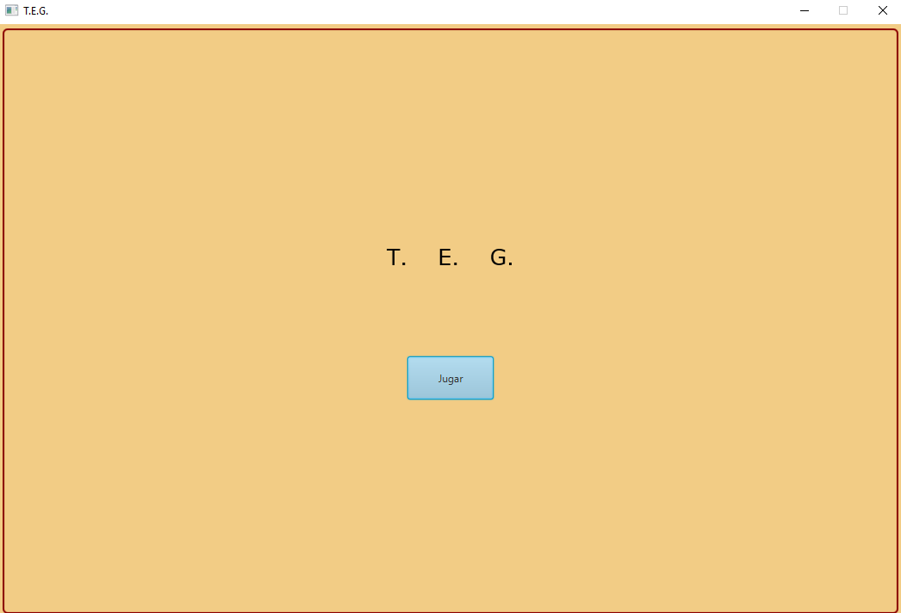
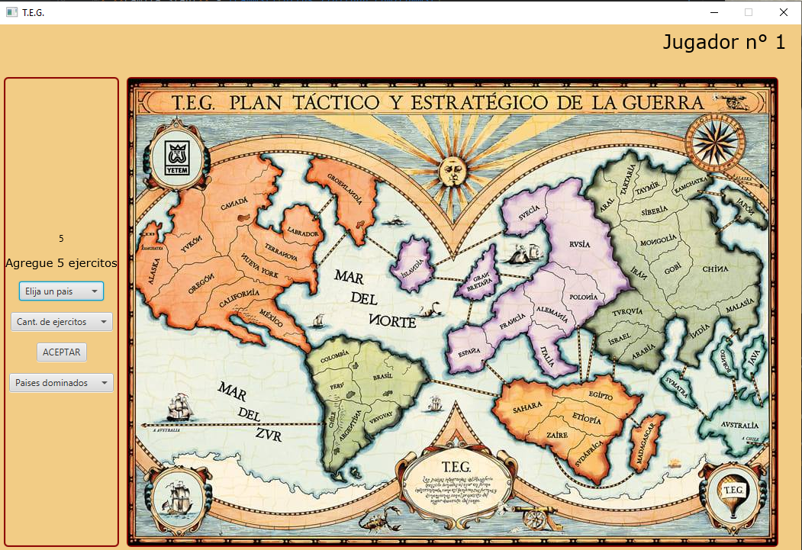

 [](https://app.codecov.io/gh/CammSt/algo3_TP2)


# T.E.G. (Plan Táctico y Estratégico de la Guerra)



## Proyecto grupal - Algoritmos y programación III

Trabajo Práctico 2 de la materia Algoritmos y Programación III de FIUBA

El presente proyecto es la solución del segundo trabajo práctico de la materia Algoritmos y Programación III. Este trabajo consiste en desarrollar una aplicación con la
cual se puede jugar al juego de mesa T.E.G. desarrolado en Java y usando Javafx para la interfaz
visual


## Grupo 9

* **Camila Stahl** - [CammSt](https://github.com/CammSt)
* **Nahuel Gomez** - [NahuelNGomez](https://github.com/NahuelNGomez)
* **Lucia Liceri Martinez** - [lucialiceri](https://github.com/lucialiceri)


Corrector: **Pablo Rodríguez Massuh - Maia**

## Aplicación

La versión más reciente de la aplicación puede encontrarse en la pestaña [releases](https://github.com/CammSt/algo3_TP2/releases/latest) y ejecutarse en Linux, Windows o Mac de esta forma:

```bash
$ java -jar <archivo.jar>
```

## Desarrollo

Aquellos que deseen colaborar con el proyecto pueden consultar la [guía de desarrollo](./docs/Desarrollo.md).

## Visualizaciones del juego

### Pantalla de inicio



### Pantalla de juego



## Licencia

Este repositorio se encuentra bajo la Licencia MIT.

